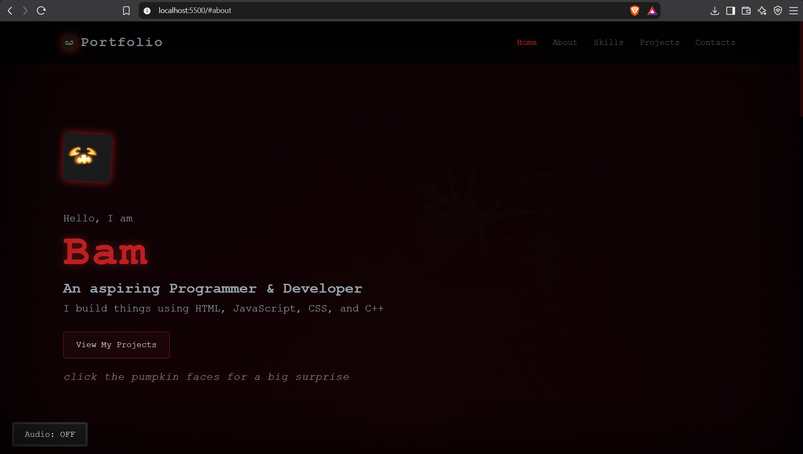
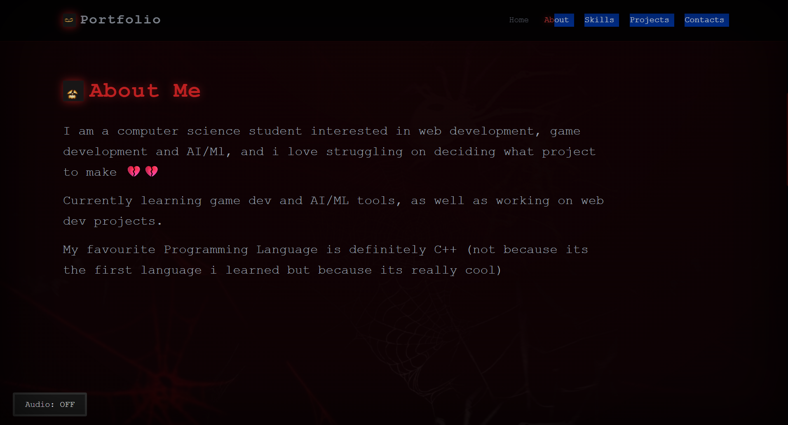

# DEMO-PORTFOLIO WEBSITE

## Description
A clean, dark spooky themed portfolio website built to display information about a demo computer science student such as background, technical skills, and projects. The website is built using HTML5, CSS3, JavaScript.

## Preview

## Features
1. Smooth Navigation
2. Interactive Links
3. Projects card
4. Spooky Audio

## Technologies and Tools used
* **HTML5** - for page structure and content layout.
* **CSS3** - for custom styling, responsive structure of the page, animations and the dark and spooky color theme.
* **JavaScript** - for scroll spy navigation tracking, creating spooky elements and an interactive audio button for turning the audio on and off.

## How to try it
1. Clone this repository
2. Open project folder in code editor (VS Code preferably)
3. [https://demo-portfolio-jade-two.vercel.app/]

## Inspiration
This is a project i've always wanted to try after i would feel confident in my ability to write HTML and CSS and I built this project as a way to test my coding and web development skills and to actually start web development instead of being stuck in the tutorial hell.

